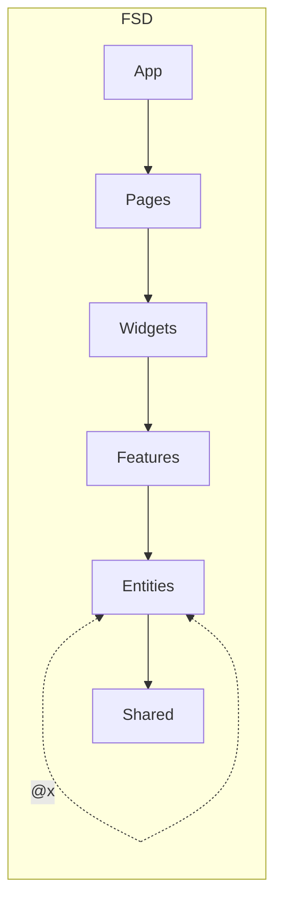

# EVfrontnew

## 🚩 Навигация
- [Архитектура](#архитектура)
- [Кодстайл](#кодстайл)
- [Общие рекомендации](#общие-рекомендации)

---

## Начало

### Требования
1. Node >= v18.13.0
2. pnpm >= 7.5.2

### Установка

1. Клонируйте репозиторий
```bash
  git clone git@gitlab.com:Konstantinwms/evfrontnew.git
```
2. Установите зависимости, подробнее про [pnpm](https://pnpm.io/ru/).
```bash
  pnpm i
```
3. Включите "EsLint" и "Prettier" в вашей IDE, чтобы все правила работали
Также установите отслеживаемые файлы для Prettier:
```bash
{**/*,*}.{js,ts,jsx,tsx,vue,astro,cjs,mjs,css,scss,html,json}
```

4. Стартуем dev сервер
```bash
  pnpm run dev
```
---


## Архитектура

#### [Feature-Sliced Design (FSD)](https://feature-sliced.design/ru/)
1. Кросс-импорты на уровне сущностей (entities) разрешены, используя "@x", [дискуссия](https://github.com/feature-sliced/documentation/discussions/390) на эту тему.



---

## Кодстайл
### 1.1 Нейминги
* Не используем сокращения в неймингах

### 1.2 Нейминги по типам сущностей
* Используем только type. Если понадобился interface, начинаем его с буквы I, пример: `IShop`
* Типы/интерфейсы для взаимодействия с бэком - дополнительно должны содержать в себе DTO, пример: `IUserDTO` / `UserDTO`. Это нужно для того, чтобы контролировать создание в коде объектов по внешним интерфейсам - объекты по DTO-интерфейсам не должны создаваться нигде, кроме точки интеграции с внешними системами, то бишь, entities.
* Енамы не используем
* Boolean-переменные начинаются с is, has. Хорошая [статья](https://dev.to/michi/tips-on-naming-boolean-variables-cleaner-code-35ig) по неймингу boolean.

### 1.3 Нейминги компонентов
* Используем kebab-case для именований в файловой структуре проекта (файлы + папки)

### 2. Оформление TODO
TODO оформляем в формате JSDoc, к каждому TODO должна быть прикреплена ссылка на задачу:
```js
// @TODO Поправить ошибки TS во время сборки
// https://app.asana.com/0/search/1234567890/0987654321
const ForkTsCheckerWebpackPlugin = require('fork-ts-checker-webpack-plugin')
```

### Общие рекомендации
1. Стараемся избегать рефов, нельзя использовать рефы для вызова дочерних компонентов.
2. Стараемся избегать дефолтных эскпортов.
3. Коммит начинается с английских: feat, chore, fix и т.д., а само описание коммита на русском.

---

### TODO проекта:
* Как только станет возможно, обновить react до 19 и поставить React Compiller. Ждём обновления Radix-примитивов (forwardRef), и пару фич с Редакса.